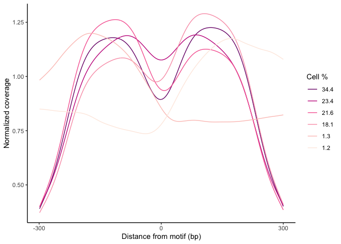

Nucleosome Estimation
================

These are expansions on the scNucleosome analyses from our paper, now on BioRxiv:
https://www.biorxiv.org/content/10.1101/2020.11.20.390971v1

## Single-cell nucleosomes around TFBS

Below is an example K-means clustering approach of nucleosome profiles
of PBMCs around the SMC3 TF motif, using scATAC readouts. Per motif and
tissue type, it is necessary to experiment with different numbers of
clusters, due to diverse cellular differentiation states and activation
mechanisms at TF-binding sites.

At the SMC3 motif, cells exhibit varying degrees of bimodality around
the motif center, often correlating with downstream expression of that
TFs’ target genes.

``` r
library(data.table)
library(RCurl)
source("https://raw.github.com/mossnicholas/scATAC/main/nucleosomes/scNuc_cluster.R")

PBMC_SMC = fread("https://raw.github.com/mossnicholas/scATAC/main/PBMC_mats/PBMC_SMC_cov_mat.txt")

ClusterNucs(coverage_matrix = PBMC_SMC, 
            clusters = 6, 
            center = FALSE)
```

<!-- -->

We can generate heatmaps visualizing nucleosome profiles of single cells
that compose each clusters. The heatmaps are ordered by NFR
(nucleosomal-free region) score, a metric which assesses nucleosomal
bimodality of an individual cell.

Here are a couple heatmaps corrosponding to two of the most populated
clusters above. Below, notice the strong, dense bimodal nucleosome
arrangement surrounding the motif center.

``` r
PBMC_cluster5 = fread("https://raw.github.com/mossnicholas/scATAC/main/PBMC_mats/PBMC_SMC_cluster5.txt")
HeatmapNucs(coverage_matrix = PBMC_cluster5,
            subset = T)
```

<!-- -->

The second example cluster has noticeablably reduced definition of the
+1 nucleosome, as most cells have fewer ATAC fragments in the 100 to 200
bp range upstream. Prior to transcription-factor binding, this +1
nucleosome is often depleted as part of an activation complex.

``` r
PBMC_cluster6 = fread("https://raw.github.com/mossnicholas/scATAC/main/PBMC_mats/PBMC_SMC_cluster6.txt")
HeatmapNucs(coverage_matrix = PBMC_cluster6,
            subset = F) 
```

<!-- -->
